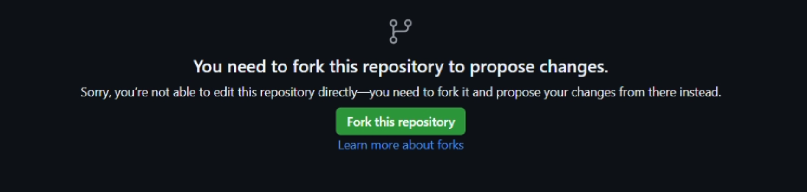
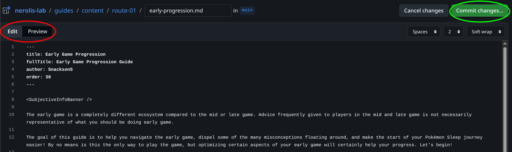
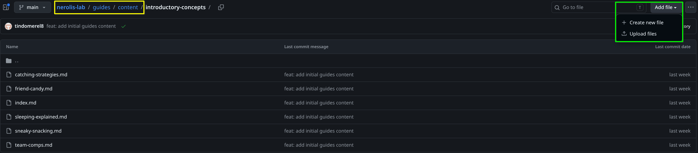
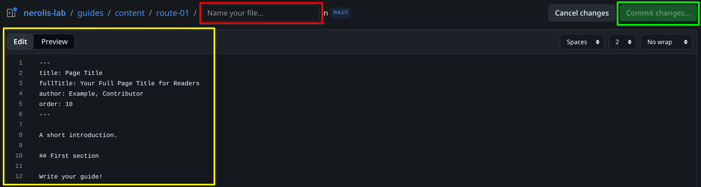
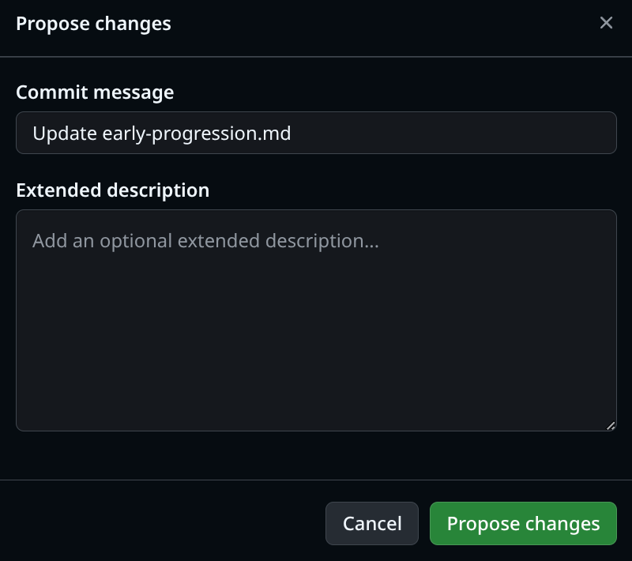
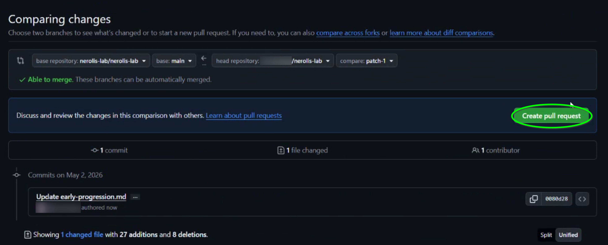
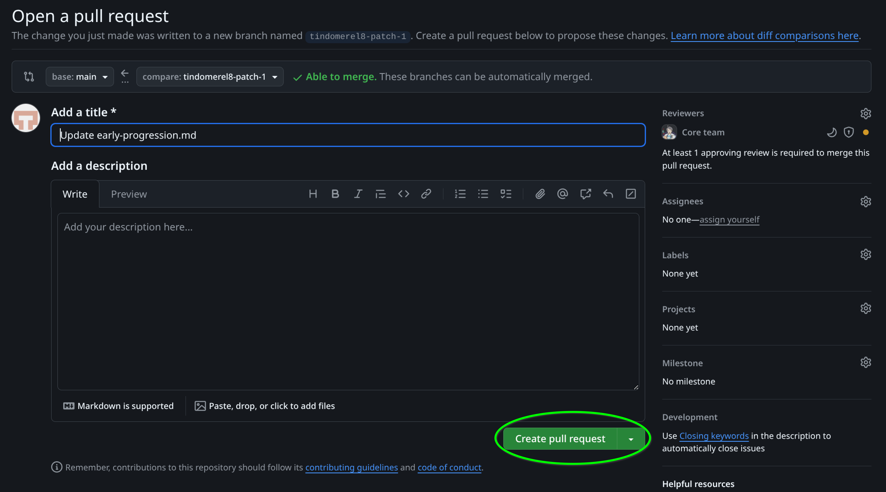

This walkthrough is for **editing or adding guides entirely in the browser**, using GitHub’s interface. You do not need to install Git or editors on your computer.

If you already know how to fork a repository, edit files, and open a pull request, you can skip this and use the [Contributing overview](./) for file locations and frontmatter.

## Before you start

1. Create a **free** [GitHub](https://github.com/) account if you do not have one yet.
2. You need to be **signed in** to GitHub.
3. If you have not contributed before, when going through these steps, GitHub may ask to **create a fork** (your copy of the repo). Create the fork when prompted so you can save changes.

> [!Important] Mental model
> You will not have direct write access to the Neroli’s Lab repository; GitHub saves your work on **your fork** until you open a **pull request** and a Neroli's Lab maintainer merges it.

## Edit an existing page

The guides site links straight to the source file for each page.

1. Open the guide on **Neroli’s Lab** in your browser (the page you want to change).
2. Scroll to the footer and click **`Edit this page on GitHub`**. GitHub will open the matching file under `guides/content/`.
3. Edit the file.
   - You can toggle between Edit and Preview mode (red circle) to preview your changes. Note that the Preview will only handle basic markdown, and certain things like banners or special formatting may not appear in the Preview here, though they will work on the live site.

4. When your edits are ready, proceed to **[commit your changes and open a pull request](#commit-your-changes-and-open-a-pull-request)**.

## Add a new page from GitHub

1. Open the **[Nerolis Lab guides/content/ folder](https://github.com/nerolis-lab/nerolis-lab/tree/main/guides/content)**.
2. Open the topic folder where you want to add your new guide.
3. Click **Add file** → **Create new file**.

4. Name the file (red box) something like `my-new-guide.md` (use lowercase and hyphens for the filename; end with `.md`)
   - If you want to add a new folder/category, name it `new-category/index.md` to create a landing page for the new category.
5. For a starting point with valid frontmatter, you can paste in the sample content from the [Contributing overview](./#adding-a-new-page) (section **Adding a new page**).

6. When you're happy with your new guide, continue with **[Commit your changes and open a pull request](#commit-your-changes-and-open-a-pull-request)**.

## Commit your changes and open a pull request

These steps are the same whether you edited an existing guide or created a new file.

1. When you are satisfied, click **Commit changes…**.

   - Write a **short commit message** that says what you changed (for example, `fix typo in sleep score guide`).
   - Click **Propose Changes**.
     - 

2. Confirm to save the commit on **your fork**. GitHub then shows how your branch differs from the base repo.

3. Open a **pull request** back to the main Neroli’s Lab repository.

That’s it for now! Maintainers will review and may merge your change, or ask for edits.

## Keep your fork up to date

If your fork is outdated, GitHub shows a **Sync fork** option on your fork’s default page on GitHub. Use it to pull in the latest changes from Neroli’s Lab before you edit, so you avoid merge conflicts.

## After your pull request is merged

Your changes appear on the live site after maintainers deploy. Small delays are normal.

## Where to get help

If you need help with GitHub or guide structure, ask in the **[Neroli's Lab Discord server](https://discord.gg/ndzTXRHWzK)**.
